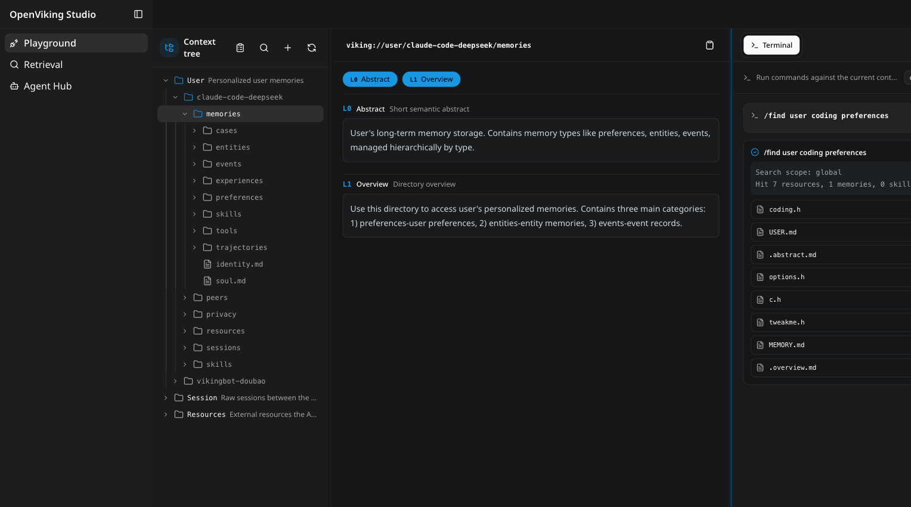

<div align="center">

<a href="https://openviking.ai/"></a>

# OpenViking

**面向 AI Agent 的上下文数据库。**

知识、记忆与技能，跨会话积累，跨 Agent 复用。

[快速开始](#快速开始) · [文档](https://docs.openviking.ai/zh/getting-started/01-introduction) · [在线体验](https://openviking.ai/studio) · [官网](https://openviking.ai/) · [版本更新](https://github.com/volcengine/OpenViking/releases)

<p>
  <a href="https://docs.openviking.ai/zh/about/01-about-us#飞书群">&nbsp;飞书</a> &nbsp;·&nbsp;
  <a href="https://docs.openviking.ai/zh/about/01-about-us#微信群">&nbsp;微信</a> &nbsp;·&nbsp;
  <a href="https://discord.com/invite/eHvx8E9XF3">&nbsp;Discord</a> &nbsp;·&nbsp;
  <a href="https://x.com/openvikingai"><picture><source media="(prefers-color-scheme: dark)" srcset="docs/images/community/x-dark.svg"></picture>&nbsp;X</a>
</p>

[English](README.md) / 中文 / [日本語](README_JA.md)

</div>

## 换 Agent，不换上下文

项目资料、个人偏好、做过的工作，不该困在某个 Agent、某次对话里。OpenViking 将它们保存在上下文窗口之外，供下一次会话、下一个 Agent 继续使用。

OpenViking 是开源数据库，以**文件和目录统一组织知识、记忆与技能**。将不同 Agent 接入同一服务和用户空间，就能通过 MCP、插件、CLI 或 SDK 复用上下文。

<a href="https://openviking.ai/studio">
  <picture>
    <source media="(prefers-color-scheme: dark)" srcset="docs/images/studio-playground-dark.png">
    
  </picture>
</a>

[在 Studio 中浏览和检索上下文](https://openviking.ai/studio)，无需安装。

## 像文件一样管理，按需要检索和读取

- **知识、记忆、技能放在一起。** 导入文档、代码和网页，与用户记忆、可复用技能统一存储，每项内容都有 `viking://` 地址。
- **找一个项目，不必搜整个库。** 将语义检索限定在指定目录，用 `ls`、`tree`、`read`、`write`、`grep` 查看和管理内容。Agent 不只是接收搜索结果，也能主动整理上下文。
- **先看摘要，再读原文。** 自动生成目录摘要（L0）和概览（L1），帮助 Agent 判断该读什么。完整内容（L2）按需读取，不必全塞进提示词。
- **留下有用的记忆，不只留下聊天记录。** 提交会话后，提取并更新用户记忆；显式开启 Agent Evolution 后，还可从任务案例中提炼可复用的经验。

```text
viking://
├── resources/                 # 文档、代码、网页
│   └── project/
│       ├── .abstract.md       # L0：这里有我要找的内容吗？
│       ├── .overview.md       # L1：这个目录里有什么？
│       └── ...                # L2：读取需要的内容
└── user/
    └── {user_id}/
        ├── memories/          # 偏好、事件、经验
        └── skills/            # 可复用的任务指令
```

需要将一堆资料整理成知识库？[`ov compile`](https://docs.openviking.ai/zh/context-compilation/01-overview) 按指定 Skill 读取来源目录，生成 Wiki、知识图谱或报告。需启用 VikingBot。

[架构设计](https://docs.openviking.ai/zh/concepts/01-architecture) · [目录检索](https://docs.openviking.ai/zh/concepts/07-retrieval) · [记忆提取](https://docs.openviking.ai/zh/concepts/06-extraction) · [经验学习配置](https://docs.openviking.ai/zh/guides/01-configuration#server-段)

## 快速开始

**启动本地服务。** 需要 Python 3.10+，以及可调用的 Embedding 模型和视觉语言模型（VLM）。使用 [uv](https://docs.astral.sh/uv/getting-started/installation/) 隔离安装环境：

```bash
uv tool install openviking --upgrade
openviking-server init      # 选择模型与提供商
openviking-server doctor    # 检查配置与连通性
openviking-server
```

**导入并检索。** 在另一个终端通过 npm 安装 CLI，运行 `ov config`。选择 **Custom**，填写 `http://127.0.0.1:1933`；默认本地服务的 API Key 留空。

```bash
npm install -g @openviking/cli
ov config
ov health

printf '# Project Atlas\nMaya owns the weekly backup. Keep backups for 30 days.\n' > quickstart.md
ov add-resource ./quickstart.md --to viking://resources/quickstart-demo --wait --timeout 120
ov overview viking://resources/quickstart-demo
ov find "Who owns the backup process?" --uri viking://resources/quickstart-demo
```

`find` 返回相关内容，不直接生成答案。用 `ov read "<返回的文件 URI>"` 读取命中项；重复导入时，请换一个未使用的目标目录。

已有服务地址？跳过服务端安装，直接用服务 URL 和用户 API Key 连接 CLI。

[完整教程](https://docs.openviking.ai/zh/getting-started/02-quickstart) · [模型配置](https://docs.openviking.ai/zh/guides/01-configuration) · [Docker 部署](https://docs.openviking.ai/zh/guides/03-deployment) · [Railway 一键部署](https://railway.com/deploy/openviking)

## 接入你的 Agent

原生集成可自动召回记忆、采集会话；MCP 为 Agent 提供主动读写上下文的工具。各集成的生命周期支持不同。

| 接入方式 | Agent |
| --- | --- |
| Hooks + MCP | [Claude Code](https://docs.openviking.ai/zh/agent-integrations/02-claude-code) · [Codex](https://docs.openviking.ai/zh/agent-integrations/04-codex) · [Cursor](https://docs.openviking.ai/zh/agent-integrations/12-cursor) · [TRAE](https://docs.openviking.ai/zh/agent-integrations/13-trae) |
| Plugin + MCP | [OpenCode](https://docs.openviking.ai/zh/agent-integrations/10-opencode) · [DeerFlow](docs/images/agents/zh/deerflow-memory-manager.md) · [DSH](https://docs.openviking.ai/zh/agent-integrations/17-dsh) |
| Context engine | [OpenClaw](https://docs.openviking.ai/zh/agent-integrations/03-openclaw) |
| 内置 Provider | [Hermes](https://docs.openviking.ai/zh/agent-integrations/05-hermes) |
| 原生扩展 | [pi](https://docs.openviking.ai/zh/agent-integrations/11-pi) |
| Connector | [豆包办公](docs/images/agents/zh/doubao-work.md) |
| Tools + store | [LangChain / LangGraph](https://docs.openviking.ai/zh/agent-integrations/07-langchain-langgraph) |

[MCP 客户端](https://docs.openviking.ai/zh/agent-integrations/06-mcp-clients) · [Agent Plugins 1.0](https://docs.openviking.ai/zh/agent-integrations/15-agent-plugins) · [集成能力对照](https://docs.openviking.ai/zh/agent-integrations/16-capability-reference)

**想用图形界面？** [OpenViking Helper](https://docs.openviking.ai/zh/agent-integrations/14-openviking-helper) 可配置本地 Agent 接入，查看会话、记忆和技能，支持 macOS 与 Windows（Beta）。

**开发自己的应用？** 使用 [Python](sdk/python/README_CN.md)、[Go](sdk/go/README_CN.md)、[TypeScript](sdk/typescript/README_CN.md) SDK 或 [HTTP API](https://docs.openviking.ai/zh/api/01-overview)。[VikingBot](https://docs.openviking.ai/zh/guides/17-vikingbot) 是项目内置的 Agent 框架。

## 评测结果

团队在 2026 年 5 月发布的评测中，记忆能力提升了长对话问答准确率和多轮任务成功率：

| 评测 | 未接入 OpenViking | 接入 OpenViking |
| --- | ---: | ---: |
| LoCoMo，OpenClaw | 24.20% | **82.08%** |
| LoCoMo，Hermes | 33.38% | **82.86%** |
| LoCoMo，Claude Code | 57.21% | **80.32%** |
| tau2-bench，Retail | 70.94% | **77.81%** |
| tau2-bench，Airline | 54.38% | **66.25%** |

LoCoMo 对比各 Agent 的原生记忆与 OpenViking 集成，这些实验中的输入 Token 减少了 34–91%。tau2-bench 对比同一 LLM 使用和不使用经验记忆的表现。

结果限于报告中的实验配置，不代表所有模型与任务。[评测报告](https://blog.openviking.ai/post/openviking-benchmark-results/) · [评测代码](benchmark)

## 部署方式

- **开源自建：** 在自己的环境运行 AGPLv3 服务，无需激活码。[部署指南](https://docs.openviking.ai/zh/guides/03-deployment)。
- **云上托管：** 使用[火山引擎 OpenViking](https://www.volcengine.com/product/openviking-service)，无需自行运维服务。[套餐与额度](https://docs.volcengine.com/docs/84313/2374478)。
- **商业私有化：** 在自己的云账号 / VPC 或离线环境部署，提供分布式部署和官方技术支持。[咨询团队](https://my.feishu.cn/share/base/form/shrcnMFqymCd9sq77sLk34Krxoc)。

开放远程访问前，请配置[身份认证](https://docs.openviking.ai/zh/guides/04-authentication)。多人共用时，参阅[用户隔离](https://docs.openviking.ai/zh/concepts/11-multi-tenant)与[资源权限](https://docs.openviking.ai/zh/concepts/15-acl)。

## 研究

记忆管理、目录检索与结构化文档 RAG 背后的研究：

- [**VikingMem**](https://arxiv.org/abs/2605.29640)：长期记忆的提取、更新与整合。
- [**Directory-Aware Query and Maintenance in Vector Databases**](https://arxiv.org/abs/2606.16903)：按目录范围建立索引和检索。
- [**VikingRAG**](https://arxiv.org/abs/2609.11390)：用更少的 Token 从结构化文档中检索证据。

## 社区与联系

由[火山引擎 Viking 团队](https://docs.openviking.ai/zh/about/01-about-us)与开源贡献者共同开发。使用交流、分享实践：

<p>
  <a href="https://docs.openviking.ai/zh/about/01-about-us#飞书群">&nbsp;飞书</a> ·
  <a href="https://docs.openviking.ai/zh/about/01-about-us#微信群">&nbsp;微信</a> ·
  <a href="https://discord.com/invite/eHvx8E9XF3">&nbsp;Discord</a>
</p>

| 要做的事 | 联系渠道 |
| --- | --- |
| 报告 Bug、提出功能建议 | [GitHub Issues](https://github.com/volcengine/OpenViking/issues) |
| 关注版本与技术文章 | <a href="https://x.com/openvikingai"><picture><source media="(prefers-color-scheme: dark)" srcset="docs/images/community/x-dark.svg"></picture>&nbsp;@openvikingai</a> · [博客](https://blog.openviking.ai/) · [版本更新](https://github.com/volcengine/OpenViking/releases) |
| 咨询商业部署 | [联系表单](https://my.feishu.cn/share/base/form/shrcnMFqymCd9sq77sLk34Krxoc) |
| 私下报告安全漏洞 | [安全政策](SECURITY.md)，请勿提交公开 Issue |

飞书链接打开入群二维码；微信需扫码添加助手，备注「OpenViking」后受邀入群。

**参与贡献：** 代码、文档、集成和可复现的问题报告都欢迎。从[贡献指南](CONTRIBUTING_CN.md)开始。

**合作项目：** [DeerFlow](https://github.com/bytedance/deer-flow) · [NoKV](https://github.com/NoKV-Lab/NoKV) · [loopx](https://github.com/huangruiteng/loopx) · [Hermes Agent](https://github.com/NousResearch/hermes-agent)

## 许可证

服务端采用 [AGPLv3](LICENSE)；[CLI](crates/LICENSE) 和[示例](examples/LICENSE)采用 Apache 2.0，其中 [Hermes 插件](examples/hermes-plugin/LICENSE)保留 MIT 许可证。第三方组件保留各自的许可证。
